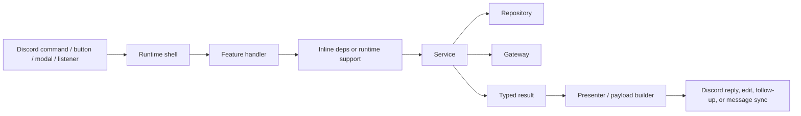

# Codebase Terminology

Use this page when you need to answer:

- what terms like `runtime shell`, `service`, `repository`, `gateway`, and `runtime support` actually mean in Arbiter
- how those layers fit together in one end-to-end flow
- why the repo uses those terms instead of simpler all-in-one handlers

## The Short Version

Arbiter is split so that each layer owns one kind of responsibility:

- runtime shells receive Discord or scheduled-task events
- feature handlers translate transport into domain input
- runtime support assembles dependencies when inline wiring would be noisy
- services own workflow rules
- repositories own persistence
- gateways own side-effect boundaries
- presenters build Discord output

That sounds like a lot of layers until you compare it to the simpler alternative:

- one command or listener file that reads input, checks permissions, queries the DB, updates Discord, and builds the reply inline

Arbiter does **not** do that because the bot has enough workflows and side effects that the simpler shape becomes fragile very quickly.

## One Full Flow

Here is the intended shape of a typical write workflow:



### Pseudo Code

```ts
// Runtime shell
onDiscordCommand(async (interaction) => {
  const context = createExecutionContext(interaction);
  await handleFeature({ interaction, context });
});

// Feature handler
async function handleFeature({ interaction, context }) {
  const guild = await resolveConfiguredGuild(...);
  const actor = await resolveInteractionActor(...);

  const result = await runFeatureWorkflow(
    createFeatureDeps({ guild, context }),
    {
      actor,
      rawInput: readDiscordInput(interaction)
    }
  );

  const payload = presentFeatureResult(result);
  await responder.safeEditReply(payload);
}

// Service
async function runFeatureWorkflow(deps, input) {
  const target = await deps.findTarget(input.targetId);
  if (!target) {
    return { kind: 'target_not_found' };
  }

  const record = await deps.repository.save(...);
  await deps.gateway.syncDiscordSideEffect(...);

  return { kind: 'completed', recordId: record.id };
}
```

That is the model the codebase is aiming for.

## Runtime Shell

### What It Is

A runtime shell is the first file that receives a real runtime event:

- slash command
- button interaction
- modal interaction
- listener callback
- scheduled task

Typical locations:

- `src/commands/`
- `src/interaction-handlers/`
- `src/listeners/`
- `src/scheduled-tasks/`

### What It Owns

- registering a command or handling a runtime event
- creating execution context
- dispatching to a feature handler or service

### What It Should Not Own

- business rules
- persistence orchestration
- big reply-branching logic

### Why This Exists

Without the shell pattern, command classes and listeners become giant runtime-centric files. That was the shape the repo was moving away from.

### Pseudo Code

```ts
export async function chatInputGiveMerit(interaction) {
  const context = createCommandExecutionContext(...);
  return handleGiveMerit({ interaction, context });
}
```

## Feature Handler

### What It Is

A feature handler is the transport-facing glue for one feature action.

Typical locations:

- `src/lib/features/.../handle*.ts`

Examples:

- `src/lib/features/merit/manual-award/handleGiveMerit.ts`
- `src/lib/features/ticket/request/handleNameChangeTicket.ts`

### What It Owns

- reading Discord input
- calling shared preflight helpers
- invoking a service
- routing the typed result into a presenter or responder

### What It Should Not Own

- deep workflow branching
- raw Prisma access
- raw nickname or message-sync orchestration

### Why This Exists

The handler is where Discord-specific concerns belong. The service should not know what a slash command option or interaction reply looks like.

### Pseudo Code

```ts
async function handleGiveMerit({ interaction, context }) {
  const guild = await resolveConfiguredGuild(...);
  const actor = await resolveInteractionActor(...);

  const result = await awardManualMeritWorkflow(
    createManualMeritWorkflowDeps({ guild, context }),
    {
      actor,
      rawMeritTypeCode: interaction.options.getString('merit_type', true)
    }
  );

  const response = presentManualMeritResult(result);
  await responder.safeEditReply({ content: response.content });
}
```

## Runtime Support

### What It Is

A runtime-support module assembles the dependencies that a service needs when that wiring would be noisy inline.

Typical locations:

- `src/lib/features/.../create*Deps.ts`
- `src/lib/features/.../*Runtime.ts`

Examples:

- `src/lib/features/merit/manual-award/createManualMeritWorkflowDeps.ts`
- `src/lib/features/event-merit/session/lifecycle/eventSessionTransitionRuntime.ts`

### What It Owns

- taking guild/context/logger/runtime objects from the feature layer
- building named collaborators for the service
- selecting the right repository and gateway methods

### What It Should Not Own

- the workflow itself
- major branching logic

### Why This Exists

This module is the line between:

- "the runtime gave us a guild, interaction, logger, and actor"
- and
- "the service wants a small set of named capabilities"

Without this pattern, services either become runtime-aware or handlers become giant wiring files. But if the dependency object is short and obvious, it should stay inline instead of being split out into ceremony.

### Pseudo Code

```ts
function createManualMeritWorkflowDeps({ guild, context, logger }) {
	return {
		upsertUser: userRepository.upsert,
		awardManualMerit: meritRepository.awardManualMerit,
		syncRecipientNickname: createNicknameGateway({ guild, context, logger }).syncNickname,
		sendRecipientDm: createDirectMessageGateway({ guild }).send
	};
}
```

## Service

### What It Is

A service owns workflow rules and sequencing.

Typical location:

- `src/lib/services/<feature>/`

Examples:

- `src/lib/services/manual-merit/`
- `src/lib/services/name-change/`
- `src/lib/services/event-lifecycle/`

### What It Owns

- validation and rule sequencing
- deciding what happens next
- deciding which typed result comes back

### What It Should Not Own

- raw interaction objects
- Discord reply construction
- raw `prisma.*`
- framework container access

### Why This Exists

This is the main domain boundary in the repo. The service is where the code answers:

- what is allowed?
- what should happen?
- what side effects are needed?
- what result should the caller handle?

### Pseudo Code

```ts
async function awardManualMeritWorkflow(deps, input) {
  const target = await deps.resolveTargetMember(input.playerInput);
  if (!target) {
    return { kind: 'target_not_found' };
  }

  const award = await deps.awardManualMerit(...);
  await deps.syncRecipientNickname(...);

  return {
    kind: 'awarded',
    meritRecordId: award.id
  };
}
```

## Repository

### What It Is

A repository is the public persistence boundary for application code.

Typical location:

- `src/integrations/prisma/repositories/`

Examples:

- `meritRepository.ts`
- `eventRepository.ts`
- `nameChangeRepository.ts`

### What It Owns

- domain-shaped persistence methods
- hiding low-level Prisma query details
- giving features and services a stable aggregate-facing API

### What It Should Not Own

- business policy that belongs in services
- Discord side effects

### Why This Exists

Without repositories, feature code would import raw query files or call `prisma.*` directly. That makes the persistence boundary harder to find and easier to bypass.

### Pseudo Code

```ts
export const meritRepository = {
	awardManualMerit,
	getUserTotalMerits,
	getUserMeritSummary
};
```

## Gateway

### What It Is

A gateway is a named wrapper around one side-effect or lookup boundary.

Typical locations:

- `src/lib/features/.../*Gateway.ts`
- `src/lib/discord/*Gateway.ts`

Examples:

- `guildNicknameWorkflowGateway.ts`
- `eventDiscordMessageGateway.ts`
- `userDirectoryGateway.ts`

### What It Owns

- a Discord-facing lookup or mutation
- a message-sync boundary
- a runtime or member lookup boundary
- a small infrastructure-facing side effect

### What It Should Not Own

- unrelated orchestration
- big workflow branching

### Why This Exists

The repo uses gateways when a service or feature needs to say, "I need _this capability_," without saying, "I know exactly how to talk to Discord, the cache, or the runtime to do it."

### Pseudo Code

```ts
function createGuildNicknameWorkflowGateway({ guild, context }) {
	const deps = createGuildNicknameServiceDeps({ guild, context });
	return {
		computeNickname: (params) => computeNicknameForUser(deps, params),
		syncNickname: (params) => syncNicknameForUser(deps, params)
	};
}
```

## Presenter / Payload Builder

### What It Is

A presenter maps typed workflow results into Discord-facing copy or components.

Typical locations:

- `src/lib/features/.../*Presenter.ts`
- `src/lib/features/.../presentation/*`

Examples:

- `manualMeritResultPresenter.ts`
- `buildMeritListPayload.ts`

### What It Owns

- content strings
- embeds
- buttons
- modals
- payload branching based on result kinds

### What It Should Not Own

- validation
- persistence
- capability checks

### Why This Exists

This keeps UI wording and component construction separate from the workflow that decided what happened.

### Pseudo Code

```ts
function presentManualMeritResult(result) {
	if (result.kind === 'target_not_found') {
		return { delivery: 'fail', content: 'Could not find that member.' };
	}

	return {
		delivery: 'edit',
		content: `Awarded ${result.meritTypeName}.`
	};
}
```

## Runtime Utility

### What It Is

A runtime utility is a long-lived app-lifetime concern that belongs to Sapphire's utility-store/runtime world rather than to a domain workflow.

Typical location:

- `src/utilities/`

Examples:

- `divisionCache.ts`
- `guild.ts`
- `userDirectory.ts`

### Why This Exists

Some concerns are genuinely runtime-scoped:

- cache state
- configured guild access
- long-lived framework-owned helpers

Those do not fit naturally inside a single service workflow.

### Important Caveat

`src/utilities/` is **not** a general helper folder. It is scanned by Sapphire's utilities store. Plain support helpers should go somewhere else.

## Runtime Gateway

### What It Is

A runtime gateway is a small wrapper that exposes the few framework/runtime things shells are allowed to use.

Typical location:

- `src/integrations/sapphire/runtimeGateway.ts`

### Why This Exists

The repo wants:

- listener and scheduled-task shells to access runtime state cleanly
- without teaching feature code and services to depend on `container.*`

### Pseudo Code

```ts
export function getRuntimeLogger() {
	return container.logger;
}

export function isRuntimeClientReady() {
	return container.client.isReady();
}
```

## Shared Discord Edge Helper

### What It Is

A shared Discord edge helper is a reusable transport-facing helper in `src/lib/discord/`.

Examples:

- `interactionPreflight.ts`
- `interactionResponder.ts`
- `autocompleteRouter.ts`
- `customId.ts`

### What It Owns

- guild and actor resolution
- responder behavior
- autocomplete routing
- custom-id parsing and typed dispatch

### Why This Exists

This layer prevents every feature handler from reimplementing the same Discord boilerplate.

### Pseudo Code

```ts
const guild = await resolveConfiguredGuild(...);
const actor = await resolveInteractionActor(...);
await responder.deferEphemeralReply();
```

## Execution Context

### What It Is

Execution context is the request-scoped metadata package that carries:

- request id
- logger
- bindings like command name, flow, transport, interaction id, user id

Key files:

- `src/lib/logging/executionContext.ts`
- `src/lib/logging/ingressExecutionContext.ts`

### Why This Exists

It makes logs and failures traceable across:

- commands
- buttons
- modals
- listeners
- scheduled tasks

### Pseudo Code

```ts
const context = createExecutionContext({
	flow: 'command.giveMerit',
	transport: 'chat_input'
});

context.logger.info({ meritTypeCode }, 'merit.manual_award.started');
```

## Typed Result

### What It Is

A typed result is the discriminated-union output returned by a service.

Example shape:

```ts
type ManualMeritResult = { kind: 'target_not_found' } | { kind: 'invalid_merit_type' } | { kind: 'awarded'; meritRecordId: number };
```

### Why This Exists

Typed results are how the repo avoids throwing application-state branches as exceptions.

They make the control flow explicit:

- services decide domain outcomes
- presenters and handlers decide how to surface them

## Why Not Simpler Code?

The simpler alternative is roughly:

```ts
async function command(interaction) {
  const guild = ...;
  const member = ...;
  const dbUser = await prisma.user.upsert(...);
  const merit = await prisma.merit.create(...);
  await guild.members.fetch(...);
  await interaction.reply(...);
}
```

That is easy to start with, but in a bot like Arbiter it quickly causes:

- huge runtime files
- hidden dependencies
- duplicated Discord and Prisma logic
- poor testability
- feature drift

The current terminology exists because the codebase is trying to make each concern explicit instead of convenient-but-hidden.

## The Fast Mental Model

If you are lost in a file, use this shortcut:

- **runtime shell**: receives the event
- **feature handler**: reads Discord input and calls the workflow
- **runtime support**: wires dependencies when inline deps would be noisy
- **service**: decides what happens
- **repository**: reads or writes the DB
- **gateway**: talks to Discord/runtime/infrastructure
- **presenter**: builds the reply

That model is usually enough to orient yourself in a new feature.

## Read This Next

- For the quick glossary:
  [Codebase Terminology](/architecture/codebase-terminology)
- For why services take dependencies:
  [Service And Dependency Design](/architecture/service-dependency-design)
- For how runtime shells fit together:
  [Discord Execution Model](/architecture/discord-execution-model)
- For where new code should go:
  [Adding Features](/contributing/adding-features)
