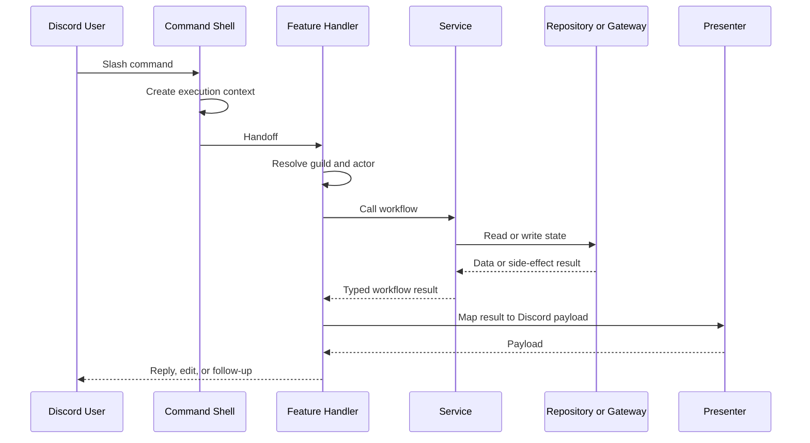

# Request Flow And Extension Points

This page explains how a request moves through Arbiter and where contributors are expected to extend the system.

The core rule is simple:

Transport-specific code should stay close to the edge. Workflow-specific code should stay in the workflow.

## One Typical Command Flow

The exact ingress type changes, but the responsibilities are meant to stay consistent.

## Execution Contexts

Every ingress creates an execution context with structured log bindings.

That context normally includes:

- a request or event identifier
- a `flow` name
- transport metadata such as command name, custom ID, or event name
- optional domain bindings such as user ID, event session ID, or action name

This is why Arbiter logs are actually usable in production: the runtime does not rely on ad hoc string logs without correlation.

## Preflight And Actor Resolution

Most Discord-facing handlers perform some combination of:

- configured guild resolution
- guild-member resolution
- database user resolution when the workflow needs persistent identity
- capability checks such as staff-only or staff-or-centurion

Those checks are intentionally centralized into reusable helpers so command handlers do not all invent their own permission and failure behavior.

## The Main Transport Patterns

### Slash Commands

Expected shape:

1. define the command surface
2. create a command execution context
3. hand off to a feature handler

If you are adding a command, the command class should stay boring. Boring is good.

### Buttons And Modals

Expected shape:

1. define a custom-id protocol
2. decode the custom ID in the interaction handler
3. create a button or modal execution context
4. hand off to a feature handler

The custom-id codec is important because it is the typed bridge between presentation and behavior. Treat it like a protocol, not a throwaway string convention.

### Autocomplete

Autocomplete follows a router pattern:

1. route by command, subcommand, and focused option
2. resolve the minimal context needed
3. return choices
4. never mutate state

Autocomplete should stay fast and side-effect free.

### Listeners

Listeners follow the same high-level contract as commands:

1. create a listener execution context
2. hand off to a workflow
3. log the outcome

The main difference is that the ingress event came from Discord itself rather than from a user-visible slash command.

### Scheduled Tasks

Scheduled tasks create their own execution context and call service code. They are the right home for recurring work, but not the right home for domain rules that should be shared with manual flows.

## Response Delivery

Arbiter uses a responder abstraction for Discord interactions so handlers do not have to repeat the same reply and error-delivery logic everywhere.

The responder handles concerns like:

- when to defer
- whether to reply, edit, or follow up
- ephemeral failure responses
- including request IDs in user-visible failure messages when appropriate
- safe logging around Discord-side delivery failures

That gives feature handlers a cleaner contract: decide what to say, not how Discord's reply state machine works.

## Where To Extend The System

### Add A New Command

Add or extend:

- a command definition
- a feature handler
- a service if the command changes business state
- a presenter if the response is more than trivial

Do not put the entire workflow directly in the command class.

### Add A New Button Or Modal Action

Add or extend:

- a custom-id builder and parser
- an interaction handler
- a feature handler
- a service if domain state changes

If the change only affects how the controls look, you may only need to touch the presenter and protocol.

### Add A New Autocomplete Surface

Add or extend:

- the autocomplete route table
- the choice builder or query helper
- optional actor or guild scoping

If the autocomplete needs expensive logic, first ask whether the UX should be changed instead.

### Add A New Listener Or Task

Add or extend:

- the ingress shell
- the relevant feature or service workflow
- logging
- tests for the called workflow

Do not hide one-off business rules in the ingress just because the trigger is not a slash command.

## A Useful Smell Test

If a file knows about all of the following at once:

- Discord interaction details
- domain rules
- storage layout
- embed construction
- retry or response delivery behavior

then the file is almost certainly doing too much.

## Search Strategy For Real Work

When you need to find the code quickly:

- search the public command name for slash-command entrypoints
- search the custom-id prefix or visible button label for interaction flows
- search the `flow` name from logs when debugging a production issue
- search `handle<Thing>` first, then trace toward the service
- search `build*Payload` or `present*` when the problem is presentation-only

## What To Read Next

- the architectural reason the repo is split this way:
  [System Overview](/architecture/runtime-overview)
- where data and caches live:
  [State, Storage, And Integrations](/architecture/data-and-storage)
- how to land a change cleanly:
  [Making Changes Safely](/contributing/adding-features)
