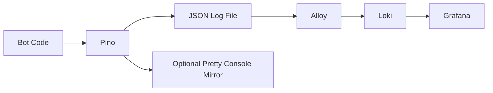

# Logging And Observability

## Why The Logging Stack Works This Way

Arbiter uses one logging model in both development and production:

- the bot always writes structured JSON logs to a file
- Alloy always tails that file
- Loki always stores the ingested logs
- Grafana is the primary place contributors and operators inspect logs

That is intentional. A contributor should not need one debugging habit for local work and a different one for production support.

## Current Flow



The canonical sink is the file log, not the console.

The canonical viewing surface is Grafana, not the terminal.

## App-Level Logging Components

The main files are:

- `src/integrations/pino.ts`
  root Pino setup and sink configuration
- `src/config/env/config.ts`
  validated logging env values
- `src/lib/logging/executionContext.ts`
  request-id-aware base context creation
- `src/lib/logging/ingressExecutionContext.ts`
  ingress-specific context helpers for commands, autocomplete, buttons, modals, listeners, and tasks
- `observability/alloy/config.alloy`
  file tailing and Loki shipping
- `observability/loki/config.yml`
  Loki storage and ingestion config
- `observability/grafana/provisioning/dashboards/`
  provisioned Grafana dashboard config and dashboard JSON
- `docker-compose.observability.yml`
  local Grafana/Loki/Alloy stack

## Logging Rules Contributors Should Follow

### 1. Keep logs request-correlated

Every command, interaction, listener, and scheduled task should run with an execution context that binds:

- `requestId`
- flow name
- transport
- relevant Discord identifiers

Use the helpers in `src/lib/logging/ingressExecutionContext.ts` instead of creating unbound loggers by hand.

### 2. Log at the edge and at meaningful state transitions

The intended shape is:

- ingress log when Discord or the runtime delivers work
- service or workflow summary log when important business actions happen
- response-delivery log when replies, edits, follow-ups, or message syncs matter for debugging
- error log with enough identifiers to find the rest of the request path

Avoid flooding the codebase with line-by-line trace logging when one action summary would explain the same outcome.

### 3. Do not treat the console as the source of truth

Console logging is optional and mostly for local convenience. The durable record is the JSON log file at `LOG_FILE_PATH`.

### 4. Prefer stable event names and useful fields

Good logs are easy to search. Prefer:

- stable event names such as ingress, workflow, or outcome events
- structured fields such as `requestId`, `flow`, `discordUserId`, `eventSessionId`, or `customButtonId`

Avoid dumping large payloads when a few identifiers and result fields would be more useful.

## Environment Variables

The main app-level logging env vars are:

- `LOG_FILE_PATH`
  where Arbiter writes newline-delimited JSON logs
- `FILE_LOG_LEVEL`
  the minimum level written to the file
- `CONSOLE_LOG_LEVEL`
  the minimum level mirrored to stdout
- `ENABLE_CONSOLE_PRETTY_LOGS`
  whether the console mirror uses `pino-pretty`

Typical intent:

- development: lower file and console levels while iterating
- production: keep file logs detailed enough for debugging, keep the console secondary

The observability containers are configured separately through Docker Compose env values such as:

- `GRAFANA_PORT`
- `LOKI_PORT`
- `ALLOY_DOCKER_VERSION`
- `LOKI_DOCKER_VERSION`
- `GRAFANA_DOCKER_VERSION`
- `BOT_LOGS_DIR`
- `GRAFANA_ADMIN_USER`
- `GRAFANA_ADMIN_PASSWORD`

See [Production Deployment](/contributing/production-deployment) for the VPS-facing values.

## Local Workflow

Start the local observability stack:

```bash
pnpm obs:up
```

`pnpm obs:up` starts the local Grafana, Loki, and Alloy containers. Use it whenever you want to inspect logs through the same UI used in production.

Useful companion commands:

- `pnpm obs:logs`
  Tails the observability containers. Use it when Grafana, Loki, or Alloy itself needs debugging.
- `pnpm obs:down`
  Stops the observability containers. Use it when you are done with the local log stack.
- `pnpm obs:reset`
  Stops the observability containers and removes their volumes. Use it when local observability state is corrupted or you want a clean reset.

If you change Loki config, Alloy config, Grafana datasource provisioning, or Grafana dashboard provisioning, prefer:

```bash
pnpm obs:reset
pnpm obs:up
```

That clears stale local observability state and forces Grafana and Loki to boot against the current repo config.

By default:

- the bot writes to `logs/arbiter.log`
- Grafana is available on `http://localhost:3001`
- Loki is available on `http://localhost:3100`

The local Grafana stack now provisions a starter dashboard named `Arbiter Logs`.

## Using The Grafana Dashboard

After `pnpm obs:up`, log in to Grafana and open:

- `Dashboards`
- `Arbiter`
- `Arbiter Logs`

Default local credentials come from `.env` or the compose defaults:

- username: `admin`
- password: `admin`

The starter dashboard includes:

- `Request ID Trace`
  a logs panel filtered by the `request_id` textbox variable
- `Logs by Flow`
  volume grouped by workflow label
- `Logs by Transport`
  volume grouped by ingress type
- `Errors and Warnings`
  warn, error, and fatal logs
- `Recent Bot Actions`
  recent structured workflow logs with flow and request context

The dashboard variables let you narrow the view without editing queries:

- `Log Detail`
  defaults to `Info+` so debug logs are filtered out; switch it to `Debug+` when you need lower-level request and task noise
- `Request ID Regex`
  leave it as `.*` to show all request IDs, or set it to one request ID to follow a single Discord action path
- `Discord User ID Regex`
  leave it as `.*` to show all users, or set it to one Discord user ID to focus the dashboard on that actor

Grafana Explore is still useful for ad hoc queries, but the provisioned dashboard should be the normal starting point.

This means local debugging should usually be:

1. start the bot
2. reproduce the flow
3. open Grafana
4. search by `requestId`, `flow`, or Discord identifiers

## Production Workflow

In production, the same model applies:

- the bot writes JSON logs into the mounted host log directory
- Alloy tails that directory
- Loki stores the logs
- Grafana is the operator UI

The production compose stack includes:

- `arbiter-bot`
- `arbiter-redis`
- `arbiter-loki`
- `arbiter-alloy`
- `arbiter-grafana`

See [Production Deployment](/contributing/production-deployment) for the full host setup and deploy sequence.

## When To Update These Docs

Update this page when you change:

- logger env vars
- sink behavior
- the observability Docker stack
- Grafana dashboard provisioning or panel intent
- request-context field conventions
- contributor expectations for how logs are inspected

## Read This Next

- For runtime shell and ingress flow shape:
  [Runtime Overview](/architecture/runtime-overview)
- For local boot and daily commands:
  [Local Development](/onboarding/local-development)
- For VPS setup and compose usage:
  [Production Deployment](/contributing/production-deployment)
