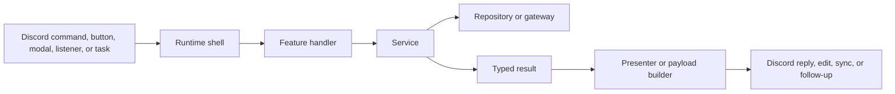

# System Overview

Arbiter is a long-running Discord bot with several kinds of ingress and several kinds of state. The code is split so contributors can follow one workflow at a time without carrying the whole runtime in their heads.

## High-Level Shape

This is the core architectural bet of the repo:

- runtime shells stay thin
- services own rules
- repositories and gateways own side-effect boundaries
- presentation stays explicit instead of leaking into domain logic

## Boot Sequence

At startup, the runtime does four important things:

1. loads environment configuration and Sapphire plugins
2. constructs the Discord client with guild and member intents plus scheduled-task support
3. logs into Discord
4. runs the startup listener, which initializes the division cache and logs the effective runtime configuration

That startup cache warm matters because division-aware behavior is used throughout the bot and should not depend on repeated database reads at every permission or nickname check.

## The Runtime Shells

Arbiter has four main ingress families.

### Commands

Slash command classes define the public command surface and hand off quickly. They should not become the place where permissions, persistence, and presentation all pile up together.

### Interaction Handlers

Buttons and modals are routed by typed custom-id protocols. The interaction handler is responsible for decoding that protocol and creating a request context, not for owning the entire business rule behind the interaction.

### Listeners

Listeners react to gateway events such as startup or guild-member lifecycle changes. They are best treated as transport ingress, just like commands, even though the user did not invoke them directly.

### Scheduled Tasks

Scheduled tasks are used for recurring maintenance and event tracking. They run with the same structured execution context approach as the Discord-facing shells.

## Why The Layers Exist

Without the split above, one file ends up doing all of the following at once:

- reading Discord input
- checking permissions
- loading data
- mutating data
- calling Discord side effects
- formatting user-facing output
- logging success and failure

That shape feels simpler at first, but it becomes hard to test and hard to reason about once workflows become multi-step or stateful. Arbiter crossed that threshold already, especially in event tracking, merit review, and identity automation.

## What Each Layer Is Supposed To Own

### Runtime Shell

Owns:

- transport-specific input
- request or event context creation
- top-level defer or reply strategy
- handoff to a clearer workflow layer

Should not own:

- domain validation
- persistence rules
- embed construction beyond trivial one-offs

### Feature Handler

Owns:

- preflight around guild, member, actor, or parsed options
- shaping raw input into workflow input
- deciding which service or presenter to call

Should not own:

- complex branching about business policy
- direct storage details unless it is only wiring collaborators together

### Service

Owns:

- business rules
- state transitions
- reconciliation logic
- typed results that explain what happened

Should not own:

- raw Discord interaction objects
- hidden container lookups
- ad hoc UI formatting

### Repository Or Gateway

Owns:

- concrete storage operations
- Redis interaction
- Discord side effects that are better treated as dependencies

Should not own:

- higher-level workflow policy

### Presenter

Owns:

- mapping typed results into messages, embeds, buttons, rows, and other response payloads

Should not own:

- mutation logic
- hidden storage access

## Dependency Assembly

Arbiter does not use one giant dependency injection container for feature logic. Instead, the repo prefers explicit assembly near the feature that needs it.

Common patterns:

- inline dependency objects when the wiring is short and obvious
- `create*Deps` helpers when the wiring is reused
- `*Runtime` helpers when a workflow needs several related Discord or persistence collaborators

That keeps service dependencies visible at the call site and makes refactors easier because you can see exactly what the workflow needs.

## Runtime State That Matters

The bot keeps three different kinds of state in play:

- durable domain state in Postgres
- transient coordination and tracking state in Redis
- process-local cached division metadata used for fast role-aware decisions

The distinction matters because contributors need to know what must survive restarts and what can be rebuilt.

## Current Runtime Responsibilities

The bot's current responsibilities cluster into two broad workflow families:

- event and merit workflows
- membership, identity, and guild automation workflows

Those families are documented separately because they have different source-of-truth rules and different failure modes.

## What To Read Next

- how requests move through the bot:
  [Request Flow And Extension Points](/architecture/discord-execution-model)
- where state lives and why:
  [State, Storage, And Integrations](/architecture/data-and-storage)
- how to change a real workflow:
  [Event And Merit Workflows](/features/event-system) or [Membership, Identity, And Guild Automation](/features/division-and-membership)
