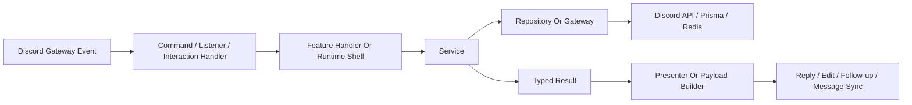

# Runtime Overview

## Boot Sequence

The app starts in `src/index.ts`.

Startup path:

1. `src/lib/setup.ts` loads environment variables and Sapphire plugin registration.
2. `src/index.ts` creates the `SapphireClient` with:
    - guild, guild member, and voice state intents
    - scheduled tasks
    - utility-store support for long-lived runtime utilities
3. the client logs in with `DISCORD_TOKEN`
4. `src/listeners/ready.ts` performs startup initialization, including division cache initialization

## High-Level Flow

## Execution Context And Logging

There are two main layers:

- `src/lib/logging/executionContext.ts`
  base request-id-aware context creation
- `src/lib/logging/ingressExecutionContext.ts`
  command, autocomplete, button, modal, listener, and scheduled-task context helpers

`src/lib/logging/commandExecutionContext.ts` exists as a small compatibility export for command shells.

Execution context carries:

- a request id
- a logger with bound metadata
- flow bindings such as interaction id, user id, command name, event session id, or custom-id details

Why it exists:

- logs stay correlated across handlers, services, and adapters
- failure responses can include request ids
- scheduled tasks and listeners use the same logging model as command flows

## Logging And Observability Runtime Shape

The current runtime logging path is:

- app logging:
  `src/integrations/pino.ts`
- validated env config:
  `src/config/env/config.ts`
- local and production collector stack:
  `observability/`
- local compose stack:
  `docker-compose.observability.yml`
- production compose stack:
  `docker-compose.prod.yml`

The important rule is that logs are file-first in both development and production:

- the bot always writes structured logs to `LOG_FILE_PATH`
- Grafana is the primary viewing surface
- console output is optional and secondary

Read [Logging And Observability](/architecture/logging-and-observability) for the full operator model.

## Runtime Utilities And Runtime Gateways

The bot still uses a small set of Sapphire utilities for app-lifetime concerns:

- division cache
- division role policy
- configured guild lookup
- member lookup
- user directory

At the app boundary, listener and scheduled-task shells use `src/integrations/sapphire/runtimeGateway.ts` when they need shared runtime access.

They do not reach into `this.container.*` directly.

That split matters:

- utilities own long-lived shared runtime state
- runtime gateways make shell code more uniform
- feature code should not depend on framework container access

## Why Services Avoid Runtime Access

`src/lib/services/` is intentionally not the place to reach into runtime globals.

The repo uses adapters and gateways so services can stay focused on:

- rule sequencing
- typed results
- named side effects

That keeps workflow code readable for new contributors and keeps tests smaller than “boot a fake bot runtime and hope the helper graph matches production”.

## Event Tracking Runtime Shape

Event tracking is no longer a standalone utility-owned workflow.

The current shape is:

- scheduled task shell:
  `src/scheduled-tasks/eventTrackingTick.ts`
- service:
  `src/lib/services/event-tracking/`
- feature dependency assembly:
  `src/lib/features/event-merit/tracking/createEventTrackingServiceDeps.ts`
- Redis integration:
  `src/integrations/redis/eventTracking/`
- event-tracking helper modules and warning-store logic:
  `src/lib/services/event-tracking/`

That means event tracking is fully service-backed now. Its helper modules live with the service instead of under `src/utilities/`, because they are workflow support code rather than Sapphire utility-store pieces.

## Scheduled Work

Current scheduled tasks:

- `src/scheduled-tasks/divisionCacheRefresh.ts`
- `src/scheduled-tasks/eventTrackingTick.ts`

These tasks should stay thin:

- check runtime readiness
- create context if needed
- call a service or runtime helper

If a task starts owning business rules, move that logic into `src/lib/services/` or feature gateways.

## Read This Next

- For command and interaction boundaries:
  [Discord Execution Model](/architecture/discord-execution-model)
- For naming and layer rules:
  [Codebase Terminology](/architecture/codebase-terminology)
- For why services use injected collaborators:
  [Service And Dependency Design](/architecture/service-dependency-design)
- For Redis and Prisma ownership:
  [Data And Storage](/architecture/data-and-storage)
- For the logging stack:
  [Logging And Observability](/architecture/logging-and-observability)
