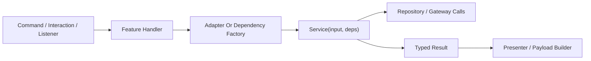

# Service And Dependency Design

Use this page when you need to answer:

- why `src/lib/services/` exists
- why services take dependencies instead of calling global helpers directly
- how to extend a workflow without pushing Discord, Prisma, or container access into the service

## What Dependency Injection Means In This Repo

In Arbiter, dependency injection is simple:

- a service owns workflow rules
- a feature adapter assembles named collaborators
- the service receives those collaborators as typed dependencies

That usually means a service depends on things like:

- a repository method
- a Discord-facing gateway
- a nickname sync collaborator
- a time or logging helper

The service does not reach into:

- `container.*`
- raw interaction objects
- raw `prisma.*`
- raw Discord client objects

## Why The Code Is Written This Way

Why doesn't the repo just use centralized helpers everywhere?

The short answer is: centralized helpers make the code look simpler at first, but they hide workflow boundaries and make change risk higher.

This service pattern exists so contributors can answer three questions quickly:

1. what is the business rule?
2. what side effects does this workflow need?
3. where is the Discord or persistence wiring happening?

With injected dependencies, those answers stay visible.

## Why Not Centralized Helpers

Centralized helper patterns usually fail in this codebase because they blur unrelated concerns together.

Example problem shape:

- a helper reads Discord state
- loads Prisma data
- applies workflow rules
- edits a message
- logs a result

That seems convenient until another workflow needs only half of that behavior. Then the helper either:

- grows more branches
- becomes hard to test
- gets copied and forked

The current pattern avoids that by keeping:

- rules in services
- persistence in repositories
- Discord side effects in gateways
- transport in handlers

## Why Not Global Container Access In Services

Sapphire container access is useful at the runtime edge, but it is the wrong default for domain services.

If a service reaches into the container directly:

- its real dependencies are hidden
- tests have to recreate runtime state instead of passing small fakes
- contributors cannot tell which external systems the workflow actually needs
- workflows become coupled to the framework instead of the domain

That is why listener shells, command shells, and feature adapters can touch runtime helpers, but service code should not.

## Why Not Large Service Classes

The repo mostly uses function-oriented services instead of big injected classes.

That choice is deliberate:

- the dependency list stays explicit at the call site
- result types stay visible
- small workflows do not need lifecycle or class state
- contributors can read one file without jumping through constructors and inheritance

The goal is explicitness, not framework-style inversion-of-control.

## Typical Flow

The important split is:

- handler knows transport
- adapter knows wiring
- service knows rules
- presenter knows Discord output

## Concrete Examples

Good places to study:

- manual merit workflow:
  `src/lib/services/manual-merit/`
  plus `src/lib/features/merit/manual-award/`
- event lifecycle workflow:
  `src/lib/services/event-lifecycle/`
  plus `src/lib/features/event-merit/session/`
- name change workflow:
  `src/lib/services/name-change/`
  plus `src/lib/features/ticket/`

Those flows all need multiple side effects, but the service files are still readable because the side-effect boundaries are named instead of hidden behind globals.

## What Belongs In A Service Dependency

Inject a dependency when the service needs:

- persistence
- Discord mutation or lookup
- nickname or rank side effects
- cross-aggregate workflow coordination
- time or runtime behavior that should be test-controlled

Do not inject tiny pure helpers just for the sake of it. Pure local functions can stay local.

## When A Helper Is Still Fine

Not everything should become an injected dependency.

Good helper candidates:

- pure parsing
- pure formatting
- small query builders local to one aggregate
- presenter-only embed builders

The rule is:

- if it is pure and local, a helper is fine
- if it crosses a side-effect boundary, name it as a dependency

## How To Extend A Service Safely

When adding new workflow behavior:

1. decide whether the change is a rule change, a side-effect change, or both
2. keep rule changes inside the service
3. add a new gateway or repository method if a new side effect is needed
4. assemble that dependency in the feature adapter
5. return a typed result if the new behavior changes reply branching

That keeps the service readable even as the feature grows.

## Smells To Avoid

- service imports from `@sapphire/framework`
- service imports raw Discord interaction types
- service imports `prisma` directly
- adapter files that start owning branching workflow logic
- “utility” helpers that secretly do database reads and Discord writes together
- passing the whole container when the service only needs one collaborator

## Read This Next

- For layer definitions:
  [Architecture Vocabulary](/architecture/vocabulary)
- For extension guidance:
  [Adding Features](/contributing/adding-features)
- For persistence boundaries:
  [Prisma Integration](/architecture/prisma-integration)
