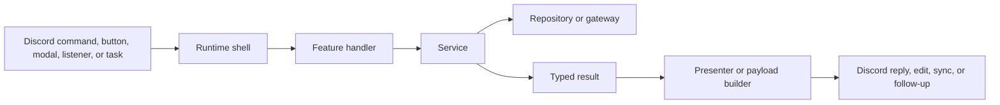

# System Guide

Arbiter is a long-running Discord bot with several ingress types, several kinds of state, and a strong preference for explicit workflow boundaries.

This page replaces the old split between runtime overview, request flow, state/storage, and observability because those topics are easier to understand together than in isolation.

## The System In One Diagram

This is the architectural bet of the repo:

- runtime shells stay thin
- services own rules and state transitions
- repositories and gateways own side-effect boundaries
- presentation stays explicit instead of leaking into domain logic

## Startup And Runtime Surface

At startup, Arbiter:

1. loads environment configuration and Sapphire plugins
2. constructs the Discord client with guild/member intents plus scheduled-task support
3. logs into Discord
4. runs the startup listener, which initializes the division cache and logs the effective runtime configuration

Today the bot exposes a small number of ingress families:

- slash command groups for `event`, `merit`, `staff`, and `ticket`
- development-only slash commands under `dev` in development mode
- button and modal flows for event lifecycle control, event review, merit pagination, division selection, and name-change review
- gateway listeners for startup and guild-member lifecycle events
- scheduled tasks for refreshing the division cache and ticking active event tracking sessions

## How Requests Move Through The Bot

No matter which ingress starts the flow, the responsibilities are meant to stay consistent:

1. the runtime shell accepts transport-specific input
2. the shell creates an execution context with log bindings
3. a feature handler resolves preflight needs such as guild, actor, or parsed options
4. a service applies business rules and returns a typed outcome
5. repositories or gateways perform concrete storage or side-effect work
6. a presenter maps the typed result into Discord-visible output when the response is non-trivial

That is why Arbiter remains navigable even though some workflows are long-lived and stateful.

## What Each Layer Owns

| Layer                 | Owns                                                                                                         | Should not own                                                           |
| --------------------- | ------------------------------------------------------------------------------------------------------------ | ------------------------------------------------------------------------ |
| Runtime shell         | Transport-specific input, request or event context creation, top-level defer or reply strategy, handoff      | Domain validation, storage policy, non-trivial presentation              |
| Feature handler       | Guild/member/actor preflight, shaping raw input into workflow input, choosing the right service or presenter | Deep business policy, hidden storage details                             |
| Service               | Business rules, state transitions, reconciliation logic, typed outcomes                                      | Raw Discord interaction objects, container lookups, ad hoc UI formatting |
| Repository or gateway | Concrete storage operations, Redis access, Discord side effects treated as dependencies                      | Higher-level workflow policy                                             |
| Presenter             | Mapping typed results into messages, embeds, rows, buttons, and payloads                                     | Mutation logic, storage access                                           |

## The Main Ingress Patterns

### Slash Commands

Command classes should stay boring:

1. define the command surface
2. create a command execution context
3. hand off

If a command class starts deciding policy, loading storage directly, and formatting multiple result branches, the design is drifting.

### Buttons And Modals

Buttons and modals follow a typed custom-ID protocol:

1. define a custom-ID builder/parser
2. decode the custom ID in the interaction handler
3. create a button or modal execution context
4. hand off to a feature handler

Treat the custom ID as a protocol between presentation and behavior, not as a random string blob.

### Autocomplete

Autocomplete follows a router pattern:

1. route by command, subcommand, and focused option
2. resolve the minimal context needed
3. return choices
4. never mutate state

Autocomplete should stay fast and read-only.

### Listeners And Scheduled Tasks

Listeners and tasks are ingress shells too. They should gather context, call shared workflow code, and log outcomes. They should not become catch-all files that hide domain rules only because the trigger is not a slash command.

## Dependency Assembly

Arbiter does not use one giant dependency injection container for feature logic. The repo prefers explicit assembly near the feature that needs it.

Common patterns:

- inline dependency objects when wiring is short and obvious
- `create*Deps` helpers when wiring is reused
- `*Runtime` helpers when a workflow needs several related Discord or persistence collaborators

That keeps dependencies visible at the call site and makes refactors easier because you can see exactly what a workflow needs.

## The State Model

Arbiter keeps three distinct kinds of state in play.

### Postgres

Postgres is the durable source of truth. It stores records that must survive restarts and support reporting, review, or later reconciliation.

Important durable aggregates include:

- users
- divisions and memberships
- name-change requests
- merit types and merit awards
- event tiers and event sessions
- tracked channels, stored message references, participant stats, and review decisions

### Redis

Redis stores transient runtime coordination data. Today that is mainly active event-tracking state:

- the set of active tracked event session IDs
- per-session tracking metadata
- per-session attendance counters keyed by Discord user ID
- short-lived coordination helpers such as review locks

The rule is simple: Redis holds state that matters while a workflow is in flight. Postgres holds state that matters afterward.

### In-Process Division Cache

Arbiter also keeps a process-local division cache loaded from Postgres and refreshed on a schedule. Division-aware behavior is common enough that repeated raw DB reads would be wasteful.

That cache affects:

- permission checks
- role-to-membership reconciliation
- nickname computation
- public division selection
- division autocomplete and lookup

If you change division semantics, think about the durable table shape, the cache refresh path, and the workflows that consume the cached data.

## Why Event Tracking Uses Both Postgres And Redis

Event tracking has two jobs:

- record live attendance cheaply over time
- persist reviewable outcomes once the event ends

Redis is a good fit for frequent live ticks. Postgres is a good fit for review decisions, awarded merits, finalized sessions, and later reporting.

When an event ends, Arbiter snapshots Redis attendance state into durable Postgres review state. That handoff is one of the most important design boundaries in the repo.

## Repository And Integration Boundaries

Most feature code should not talk directly to the raw Prisma client.

Instead, Arbiter uses domain-shaped repositories such as user, division, merit, name-change, event, and event-review repositories. Below those repositories, Prisma query modules are grouped by aggregate and scenario rather than hidden behind a single generic data-access layer.

Beyond Postgres, the main integration boundaries are:

- Redis for transient tracking and coordination
- Discord for side effects such as posting, editing, or renaming
- Sapphire runtime access for client and scheduled-task integration
- Pino for logging

If behavior reaches outside the process, make that dependency explicit.

## Logging And Observability

Arbiter treats logging as part of the runtime contract.

At runtime:

- the bot writes structured JSON logs to a file
- optional console output mirrors logs for local development
- Alloy tails the log file
- Loki stores the logs
- Grafana reads from Loki

The same file-first model exists locally and in production, so debugging techniques transfer cleanly between the two.

## Execution Contexts And Correlation

Every ingress creates an execution context. That context normally carries:

- a request or event identifier
- a `flow` name
- transport metadata such as command name, custom ID, or event name
- optional workflow bindings such as user ID, action name, or event session ID

This is why Arbiter logs are usable in production:

- the ingress can be tied to child workflow logs
- side-effect failures stay correlated
- user-visible error messages can include request IDs for operator follow-up

The `flow` field is especially important because it survives refactors better than deep file paths.

## What Good Logs Look Like

Good Arbiter logs answer three questions:

- what workflow was running
- what identifiers mattered
- whether the operation succeeded, failed, or only partially succeeded

Helpful bindings usually include:

- Discord user ID
- guild ID
- command name or subcommand
- event session ID
- request ID
- action name

Partial success matters in this repo. If a domain update succeeded but a DM failed, or a bulk nickname sync updated most users but not all, log that as partial success rather than clean success.

## Testing Implications

Use unit tests when:

- the change is about branching, validation, or presentation
- dependencies can be faked cheaply

Use integration tests when:

- the change depends on Prisma queries or transactions
- the change depends on Redis semantics
- the bug only appears when storage and workflow logic interact together

## Smell Tests

The design is usually drifting if a single file knows about all of the following at once:

- Discord interaction details
- domain rules
- storage layout
- embed construction
- retry or response delivery behavior

It is also usually drifting when:

- durable state gets placed in Redis because it was quicker to wire
- feature code bypasses repositories and reaches directly for the Prisma client
- services start formatting Discord-facing payloads
- logging omits the workflow identifiers needed to debug production issues

## What To Read Next

- contributor entrypoints and change recipes:
  [Contributor Guide](/contributing/change-guide)
- the most stateful domain in the repo:
  [Event And Merit Workflows](/features/event-system)
- identity, division, and nickname rules:
  [Membership, Identity, And Guild Automation](/features/division-and-membership)
