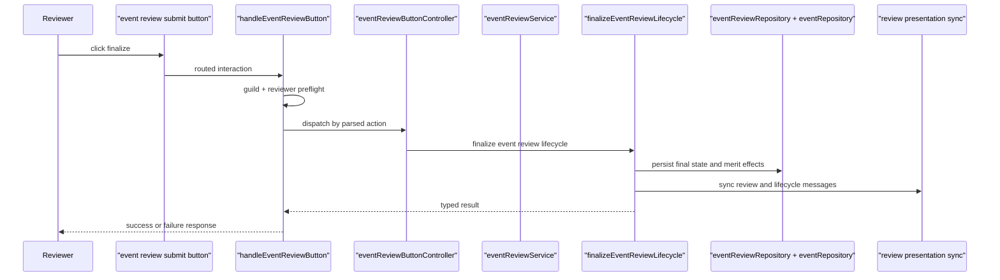

# Event Review And Finalization

## What This Page Covers

This page is about:

- loading review pages
- saving attendee review decisions
- refreshing review presentation
- finalizing reviews with or without merits

Primary code:

- interaction handler:
  `src/interaction-handlers/eventReviewButtons.ts`
- feature modules:
  `src/lib/features/event-merit/review/`
- services:
  `src/lib/services/event-review/`
  and `src/lib/services/event-lifecycle/`

## Interaction Surface

Review buttons are decoded through:

- `parseEventReviewButton.ts`
- `eventReviewButtonController.ts`
- action-specific modules such as:
    - `runRefreshEventReviewPageAction.ts`
    - `runRecordEventReviewDecisionAction.ts`
    - `runFinalizeEventReviewAction.ts`

That split keeps button parsing, action routing, and workflow execution separate.

## Decision And Page Loading

`eventReviewService.ts` owns:

- review-page loading
- review-page refresh
- decision persistence rules
- lock behavior once an event is finalized

The service does not finalize event state. Finalization is a lifecycle concern because it changes the event session state.

## Finalization Flow

Main files:

- `src/lib/features/event-merit/review/createFinalizeEventReviewLifecycleDeps.ts`
- `src/lib/services/event-lifecycle/finalizeEventReviewLifecycle.ts`
- `src/integrations/prisma/repositories/eventReviewRepository.ts`

## Why Finalization Lives In Lifecycle

Finalization changes more than review state:

- the event session moves to a finalized state
- merit records may be created
- review presentation changes
- lifecycle presentation may also need sync

That is why:

- `event-review` owns review interaction behavior
- `event-lifecycle` owns final state transitions

## Common Extension Points

- new review action or button type:
  `src/lib/features/event-merit/review/`
- new review decision rule:
  `src/lib/services/event-review/eventReviewService.ts`
- new finalization side effect:
  `src/lib/services/event-lifecycle/finalizeEventReviewLifecycle.ts`
- new review UI:
  `buildEventReviewPayload.ts` and related review presentation modules

## Common Pitfalls

- do not put finalization policy in payload builders
- do not add event-state mutations directly to review button handlers
- keep review page loading and decision persistence in the review service, even when a feature change looks presentation-heavy

## Before Editing

Read these first:

- `src/interaction-handlers/eventReviewButtons.ts`
- `src/lib/features/event-merit/review/handleEventReviewButton.ts`
- `src/lib/features/event-merit/review/eventReviewButtonController.ts`
- `src/lib/services/event-review/eventReviewService.ts`
- `src/lib/services/event-lifecycle/finalizeEventReviewLifecycle.ts`
- `src/integrations/prisma/repositories/eventReviewRepository.ts`

## Related Docs

- [Event System](/features/event-system)
- [Event Session Lifecycle](/features/event-session-lifecycle)
- [Event Discord Presentation](/features/event-discord-presentation)
- [Aggregate Reference](/reference/aggregate-reference)
