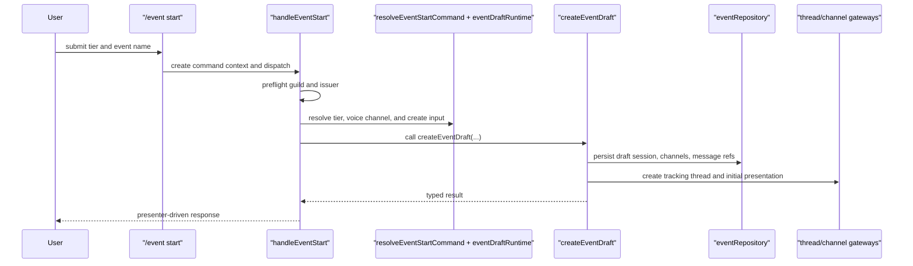

# Event Session Lifecycle

## What This Page Covers

This page is about session lifecycle behavior:

- creating event drafts
- adding child voice channels
- activating drafts
- cancelling drafts
- ending active events

Primary code:

- command shell:
  `src/commands/event.ts`
- feature handlers:
  `src/lib/features/event-merit/session/`
- service:
  `src/lib/services/event-lifecycle/`

## Draft Creation Flow

Main files:

- `src/lib/features/event-merit/session/draft/handleEventStart.ts`
- `src/lib/features/event-merit/session/draft/resolveEventStartCommand.ts`
- `src/lib/features/event-merit/session/draft/eventDraftRuntime.ts`
- `src/lib/services/event-lifecycle/createEventDraft.ts`

## Add-VC Flow

Main files:

- `src/lib/features/event-merit/session/add-vc/handleEventAddVc.ts`
- `src/lib/features/event-merit/session/add-vc/runAddTrackedChannelAction.ts`
- `src/lib/services/event-lifecycle/addTrackedChannel.ts`

This flow:

- validates the selected session
- blocks reserved-channel reuse across events
- persists the added child VC
- syncs tracking-summary presentation
- posts thread and public timeline messages

## Transition Flow

Main files:

- `src/lib/features/event-merit/session/buttons/handleEventStartButton.ts`
- `src/lib/features/event-merit/session/lifecycle/eventSessionTransitionRuntime.ts`
- `src/lib/services/event-lifecycle/transitionEventSession.ts`

Lifecycle actions currently include:

- `activateDraftEvent`
- `cancelDraftEvent`
- `endActiveEvent`

The transition rules are centralized in `src/lib/services/event-lifecycle/transitionEventSession.ts`. Add transition rules there first, then update the workflow and presentation layers.

## Why This Split Exists

Lifecycle code has to coordinate:

- state-machine validation
- session persistence
- channel reservation and topology rules
- presentation sync
- review initialization

That is why the service owns state changes while feature runtime support assembles the Discord and repository collaborators.

## Common Extension Points

- new lifecycle action:
  `src/lib/services/event-lifecycle/`
- new start-command validation:
  `src/lib/features/event-merit/session/draft/resolveEventStartCommand.ts`
- new session-side Discord payload:
  session presenters and `src/lib/features/event-merit/presentation/`

## Common Pitfalls

- do not put new state rules in button handlers
- do not bypass the state machine for one-off transitions
- keep channel-specific side effects in gateways or runtime support, not in the command shell

## Before Editing

Read these first:

- `src/commands/event.ts`
- `src/lib/features/event-merit/session/draft/handleEventStart.ts`
- `src/lib/features/event-merit/session/add-vc/handleEventAddVc.ts`
- `src/lib/features/event-merit/session/buttons/handleEventStartButton.ts`
- `src/lib/services/event-lifecycle/createEventDraft.ts`
- `src/lib/services/event-lifecycle/addTrackedChannel.ts`
- `src/lib/services/event-lifecycle/transitionEventSession.ts`

## Related Docs

- [Event System](/features/event-system)
- [Event Review And Finalization](/features/event-review-and-finalization)
- [Event Discord Presentation](/features/event-discord-presentation)
