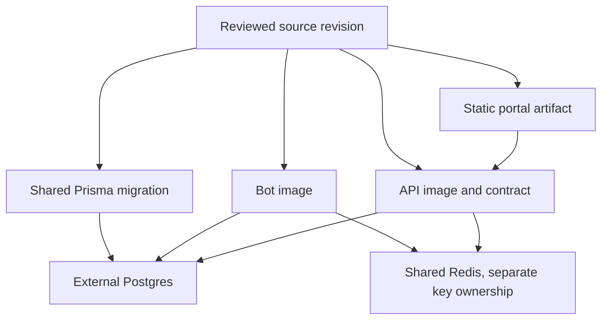

# Release And Operations

Arbiter separates source publication from production operation:

- **Source publication** promotes reviewed `dev` history to `main`, creates the
  git tag and GitHub release, and may announce the release to Discord.
- **Production deployment** selects an approved source revision, builds or
  retrieves its artifacts, applies its shared migration once, and operates the
  bot, API, and portal independently.

Neither action performs the other. Merging `dev` to `main` does not deploy a
container, run a migration, change a proxy, or publish the portal to Vercel.

## Choose Your Path

| You need to... | Start here |
| --- | --- |
| Prepare a working branch for review | [Release contributions and source publication](../contributing/release-process.md#working-branch-path) |
| Preview or publish a `dev` to `main` source release | [Release contributions and source publication](../contributing/release-process.md#source-publication-path) |
| Perform a first production deploy | [Production deployment](./production-deployment.md#first-deploy) |
| Update one or more production artifacts | [Production deployment](./production-deployment.md#normal-update) |
| Verify the bot, API, portal, Redis, and log shipping | [Production deployment](./production-deployment.md#minimum-verification) |
| Roll back, disable a surface, or respond to an incident | [Recovery and incidents](./recovery.md) |
| Inspect Redis memory or BullMQ scheduled-task state | [Redis and BullMQ](./redis-and-queues.md) |
| Investigate a dependency advisory in shipped artifacts | [Runtime dependency audits](./dependency-audits.md) |
| Prepare the API proxy, browser authentication, or portal security boundary | [API and portal deployment readiness](../api/deployment-readiness.md) |

## One Revision, Independently Operated Artifacts

One compatible repository revision owns the migration, bot image, API image,
shared API contract, and portal artifact. They may be deployed or rolled back
independently only while the selected revisions remain compatible.

Production Compose owns the migration, bot, API, Redis, Loki, Alloy, and
Grafana services. The portal is a separate static Vercel artifact; it is not a
Compose service and must wait for a compatible API to be ready.

## Minimum Approved Production Path

After separate operational approval:

1. Record the source revision and immutable migration, bot, API, and portal
   artifact identifiers. Retain the prior compatible identifiers.
2. Verify the external Postgres backup and the existing Redis persistence path.
3. Build or retrieve every affected artifact from the compatible source revision.
4. Apply the repository migration once against the shared database.
5. Start or update the API and bot without treating one runtime as proof of the other.
6. Verify bot connection, API health and readiness, Redis dependencies, and the
   separate bot/API log streams.
7. Deploy and verify the compatible portal artifact last.

The detailed deploy commands and evidence are in
[Production deployment](./production-deployment.md). Security-sensitive API and
portal inputs remain owned by the
[deployment-readiness runbook](../api/deployment-readiness.md).

## Approval Boundary

These pages describe procedures; they do not authorize production, migration,
secret, infrastructure, Discord, Vercel, recovery, or destructive actions.
Obtain explicit current approval before operating live systems. Never improvise
a down migration, delete Redis data, flush Redis, drop credential tables, rotate
the credential pepper, or restore a database merely because a runbook mentions
the action.
